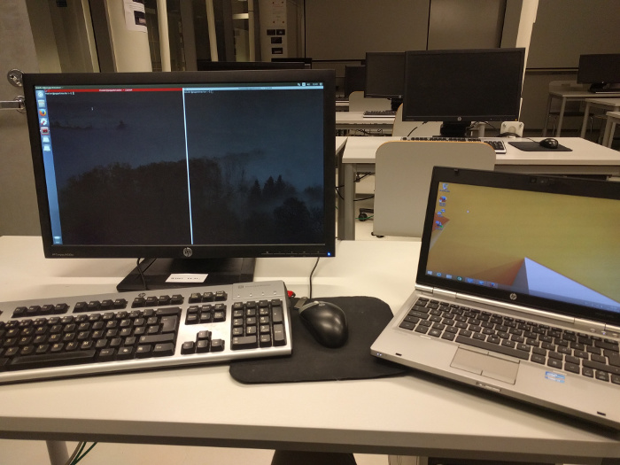
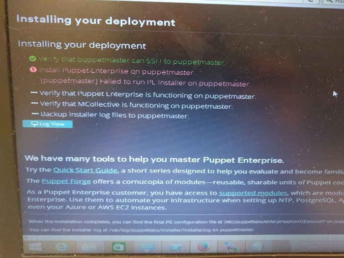
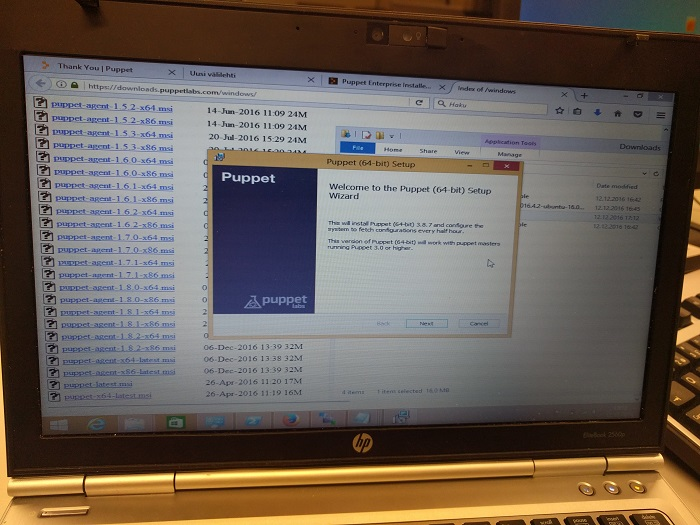
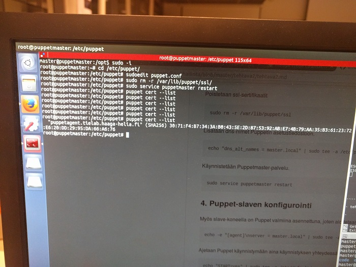
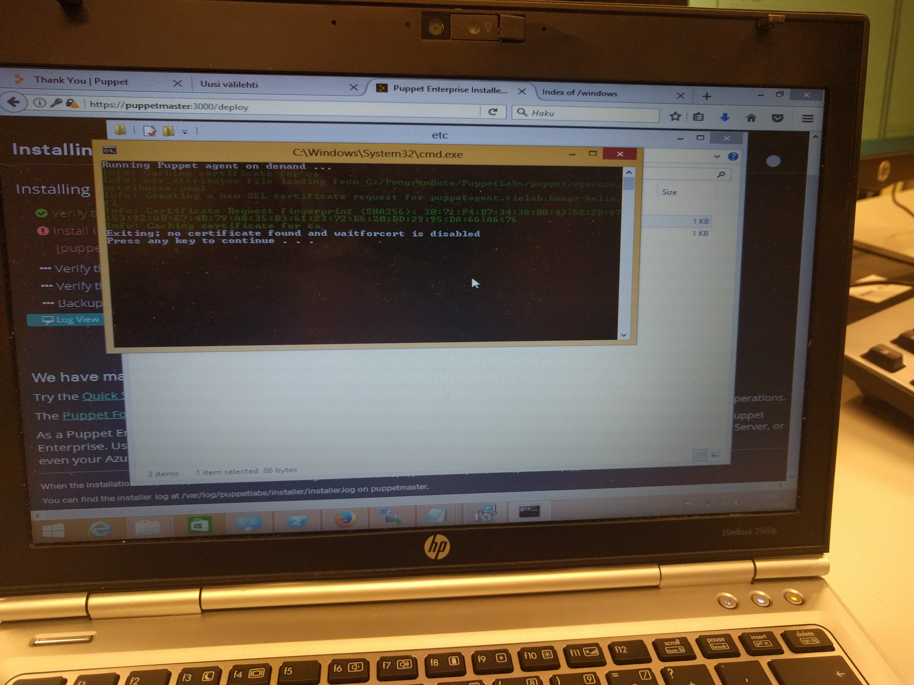
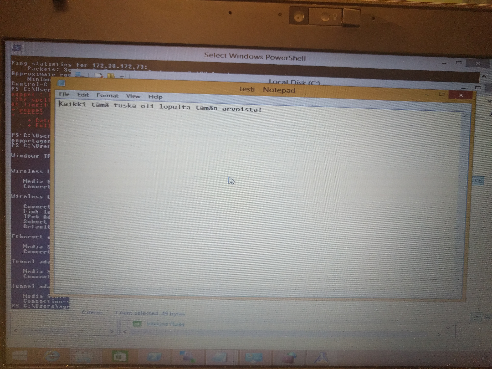
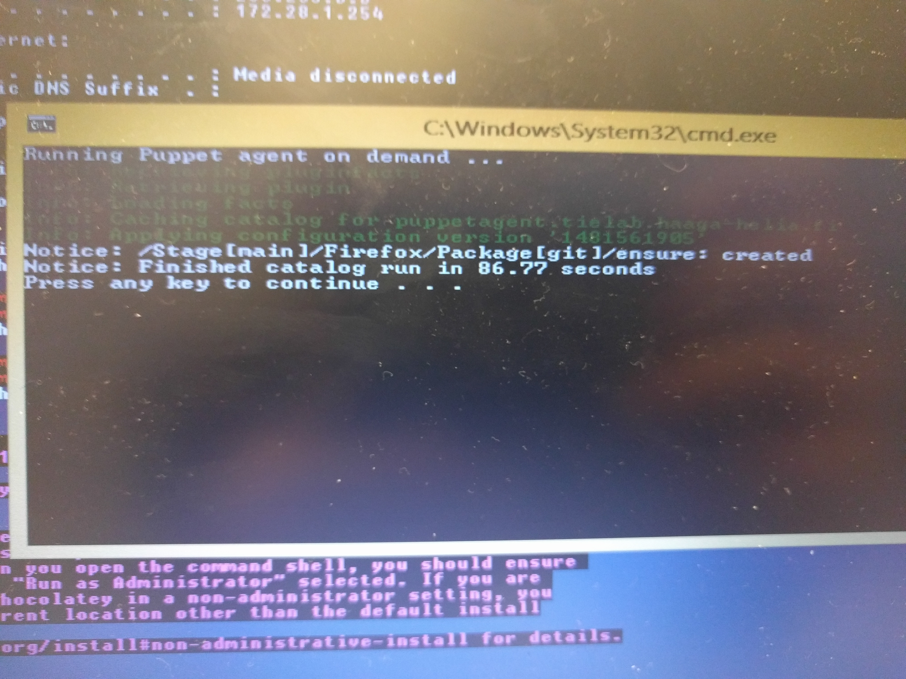

#Linuxin keskitetty hallinta

####Juha-Matti Ohvo

#####13.12.2016

##1. Moduulin esittely

Moduuli on Linuxin keskitetty hallinta -kurssia varten luotu Puppet-moduuli. 

##2. Työympäristö

Työssä on käytetty kahta fyysistä tietokonetta, joista toinen toimii Puppetmaster-palvelimena (Ubuntu 16.04.1 LTS 64-bit) ja toiselle on asennettu Windows 8.1 64-bittinen käyttöjärjestelmä ja joka toimii Puppet agenttina. Puppetmaster-palvelimena toimii Haaga-Helian laboratorioluokan 5005 tietokone ja agenttikoneena HP Elitebook 2560p.

##3. Alkuvalmistelut

Puppetilla on mahdollista tehdä Windows-tietokoneista Puppet agentteja, mutta Puppetmaster vaatii Linux-palvelimen. Puppetin virallisilla sivuilla löysin ensimmäiseksi [tämän ohjeen](https://docs.puppet.com/pe/latest/windows_installing.html), jossa Puppetmaster valmistellaan ottamalla SSH-yhteys Windows koneelta Linux-palvelimelle, viemällä Puppetmasterin asennus palvelimelle ja ajetaan lopuksi asennus palvelimella. Asennuksen aikana siirrytään Windows-koneella selaimelle ja suoritetaan asennus loppuun graafisessä käyttöliittymässä.

Kyseinen ohje toimi, mutta itse Puppetmasterin asennus ei onnistunut ollenkaan. Asennuslokissa virheviestit valittivat puuttuvista tiedostoista /opt -hakemistossa, mutta jos asennus ajetaan ensimmäistä kertaa, miksi ohjeissa ei mainita lainkaan että /opt -hakemistossa täytyisi olla valmiina asennukseen tarvittavia tiedostoja. Neljän tunnin selvittämisen jälkeen luovutin tämän asennuksen suhteen.

Mietin ongelmatilanteiden jälkeen, miksi Windows-koneesta ei voisi tehdä agenttia samaan tapaan kuin Linuxilla, eli asennetaan Puppet client-ohjelmisto agentille, lisätään master-palvelin asetuksiin ja allekirjoitetaan sertifikaatit Puppetmasterilla. Googlella löysinkin Puppetin [virallisen ohjeen tätä varten](https://docs.puppet.com/puppet/latest/install_windows.html).

##4 Koneiden valmistelu

####4.1 Puppetmasterin valmistelu

Tämän vaiheen alkaessa meillä on Linux-palvelin, jossa pyörii Ubuntu 16.04.1 LTS 64-bittinen käyttöjärjestelmä. Päivitetään pakettilistat ja asennetaan Puppetmaster. Tietokoneen hostname on "puppetmaster".

	$ sudo apt-get update && sudo apt-get install Puppetmaster -y

Kun Puppetmaster on asennettu, pysäytetään Puppetmaster-palvelu poistetaan sertifikaatit.

	$ sudo service puppetmaster stop && sudo rm -r /var/lib/puppet/ssl

Lisätään masterin dns-nimet Puppetin asennustiedostoon. Hostname on "puppetmaster", jolloin luonnollisesti tämä on dns_alt_name.

	$ echo "dns_alt_names = puppetmaster" | sudo tee -a /etc/puppet/puppet.conf

Käynnistetään lopuksi Puppetmaster.

	$ sudo service puppetmaster start

####4.2 Windows Puppet agentin valmistelu

Tämä vaihe edellyttää, että Windows on asennettuna koneelle, UAC on poistettu käytöstä sekä palomuurista on avattu TCP-portti 8140 Puppettia varten. Windows-koneen hostname on "puppetagent" ja lisäksi Puppetmasterin hostname ja ip-osoite täytyy määritellä hosts-tiedostoon. Ladataan ensiksi Puppet agentin .msi-asennuspakettin Windows-koneelle. Asennuspaketit Windowsille löytyvät [Puppetin sivuilta](https://downloads.puppetlabs.com/windows/).

Edetään asennuksessa eteenpäin kunnes asennus on valmis.

Nyt meillä on Windows koneelle asennettuna Puppet agent client. Seuraavaksi meidän pitää määritellä, miltä palvelimelta Puppet-asetukset tulevat. Etsitään Windows-koneen C:-levyltä tiedostoa puppet.conf. Lisätään puppet.conf -tiedostoon seuraavat rivit.

	[agent]
	server = puppetmaster

Seuraavaksi tehdään sertifikaattien allekirjoitus.

####4.3 Setifikaatin allekirjoittaminen Puppetmasterilla

Puppetmasterilla ajetaan komento, jolla nähdään, mitkä agentit ovat ottaneet Puppetmasteriin yhteyttä ja vaativat sertifikaatin allekirjoituksen.

	$ sudo puppet cert --list

Meillä on näkyvillä "puppetagent"-niminen agent, joka on juurikin Windows-koneemme.

Allekirjoitetaan sertifikaatti.

	$ sudo pupper cert --sign --all

Sertifikaatti allekirjoitettiin onnistuneesti.

####4.4 Puppetin testaus

Testataan, että voimme Puppetmasteriltamme luoda tiedoston Windows-koneelle, eli toisin sanoen varmistetaan Puppetin toimivuus. Luodaan tekstitiedosto Windows-koneen C:-levyn juureen.

Ensiksi luodaan moduuli, jonka nimi olkoot "firefox", koska yritämme myöhemmin Firefox-selaimen asennusta Windows-koneelle.

	$ cd /etc/puppet
	$ sudo mkdir -p /modules/firefox/manifests
	$ sudoedit /modules/firefox/manifests/init.pp

Lisätään seuraava koodi tiedostoon:

	class firefox {
		file { "c:/testi.txt":
			content => "Kaikki tämä tuska oli lopulta tämän arvoista!",
		}
	}

Lisätään vielä /etc/puppet/manifests -hakemistoon site.pp -manifesti, johon lisätään agentit, joille komentoja annetaan ja mitä moduuleja käytetään.

	$ sudoedit /etc/puppet/manifests/site.pp

Lisätään tiedostoon seuraava koodi:

	node "puppetagent.tielab.haaga-helia.fi" {
		include firefox
	}

Ajetaan tämän jälkeen komento, joka enabloi Puppet agentin.

	$ sudo puppet agent --enable

Windows koneella avataan käynnistysvalikko (Start menu) ja etsitään "Run Puppet agent" -ohjelma. Käynnistetään ohjelma ja odotellaan, kunnes agentti on hakenut asetukset Puppetmasterilta. Kun prosessi on valmis, tarkistetaan onko tiedostoa luotu C:-aseman juureen. Tiedosto löytyy oikeasta paikasta oikealla nimellä, joten Puppetmaster ja Windows-kone Puppet agenttina toimivat!

##5. Windows-ohjelmien asennus Puppetilla ja Chocolateylla

Toisin kuin Linux-käyttöjärjestelmissä, Windows-järjestelmissä ei ole asennettuna omaa virallista paketinhallintaohjelmistoa. Paketinhallinta on kuitenkin mahdollista käyttäen Chocolateyta, jota kutsutaan Windowsin "omaksi apt-getiksi" (lähde: https://chocolatey.org). Chocolateyta varten on pakettivarasto, jossa on tarjolla tuhansia ylläpidettyjä paketteja. Tämän enempää emme käy tehtävässä Chocolateyta ja virallisilla sivuilla on kattavasti tietoa kyseisestä ohjelmasta (https://chocolatey.org).

####5.1 Chocolateyn käyttäminen Puppet-moduuleissa

Jotta Chocolateyta voidaan käyttää mooduleissa, vaatii se Chocolatey-moduulin asentamista Puppetforgesta. Tehdään tämä toimenpide.

	$ sudo puppet module install chocolatey-chocolatey

Nyt voimme käyttää Chocolatey-moduulia. Muokataan aiemmin tehtyä firefox-moduulia ja käytetään package-resurssia.

	include chocolatey
	
	class firefox {
		package { "firefox":
			ensure		=> "installed",
			provider	=> "chocolatey",
		}

		file { "c:/testi.txt":
			content		=> "Toimiikohan tämäkin tiedosto?",
		}
	}

Ajetaan moduuli samalla tavalla kuin aiemmin, eli Windows-koneella käynnistetään Puppet agent -ohjelma käynnistysvalikosta.

Moduuli on ajettu läpi ilman virheitä, mutta Firefoxia ei ole asennettu. Tässä vaiheessa arvelen syyn johtuvan siitä, että Haaga-Helian verkon takaata on vaikeaa asentaa paketteja Chocolateylla. Olen itse aiemmin yrittänyt asentaa paketteja koulun verkossa olevalla Windows-koneella, muttei se tahtonut onnistua, kun taas kotiverkossani Chocolatey toimi ongelmitta. Koulun verkossa olen onnistunut asentamaan Chocolateylla Gitin, joten kokeillaan tämän asentamista Firefoxin sijaan.

Muokataan moduulia.

	include chocolatey
	
	class firefox {
		package { "git":
			ensure		=> "installed",
			provider	=> "chocolatey",
		}

		file { "c:/testi.txt":
			content		=> "Toimiikohan tämäkin tiedosto?",
		}
	}

Windows-koneella ajetaan Puppet agent.

Nyt moduulin ajaminen kesti liki 80 sekuntia ja virheilmoituksia ei ilmennyt, joten asennuksen voi olettaa olleen onnistunut. Katsotaan, löytyykö Git käynnistysvalikosta.

Kuten kuvasta näkyy, Git asentui Windows-koneellemme ja teimme sen käyttäen Puppetia ja Chocolateyta.

##6 Windowsin ryhmäkäytäntöjen muokkaaminen Puppetilla

Windowsin ryhmäkäytäntöjä voidaan muokata vain paikallisesti, mikäli työasemaa ei ole liitetty toimialueelle. Tarvitsemme lisäksi moduulin, jolla voimme muokata ryhmäkäytäntöjä ja googlettamalla Forgesta löytyi tätä varten moduuli "".

	$ sudo puppet module install cannonps-local_group_policy

Luodaan uusi hakemisto moduulille.

	$ cd /etc/puppet/modules
	$ sudo mkdir -p policy/manifests
	$ sudoedit policy/manifests/init.pp

Haluamme asettaa ryhmäkäytännön, joka vaatii vähintään 12 merkkisen salasanan.

Lisätään init.pp -tiedostoon seuraava koodi.

	import local_group_policy

	class policy {
		policy_settings {
			name		=> "Minimum Password Length",
			policy_value	=> "12",
		}
	}

Moduuli ei toimi ja antoi useita virheitä. Googlettamalla löysin yllättäen suomenkielisen Puppeteers.fi -sivuston, josta löytyi blogikirjoitus aiheella "Windowsin paikallisten ryhmäkäytäntöjen muokkaus Puppetilla" (https://www.puppeteers.fi/windowsin-paikallisten-ryhmakaytantojen-muokkaus-puppetilla/).

	"Skaalautuvampi lähestymistapa olisi muokata Registry.pol-tiedoston yksittäisiä käytänteitä. Käytänteiden
	määrittämiseen on olemassa oma Puppet-moduulikin, cannonps/local_group_policy, josta PuppetLabs paikutti 
	aikoinaan kovastikin henkseleitä. Moduulin sisältämässä providerissa on kuitenkin lukuisia ongelmia:

	- Se ei toimi lokalisoidussa, esim. suomenkielisessä Windowsissa, koska se tekee naiiveja oletuksia 
	  C:\Windows\PolicyDefinitions -hakemiston rakenteesta.
	
	- Registry.pol-tiedoston polku on virheellinen

	- Se vaikuttaa halvaantuvan, jos Registry.pol-tiedosto on tyhjä

	- Toteutustapa on todella monimutkainen: se lukee XML-tiedostopareista GPO-objektien määritteet (.admx) 
	  sekä käännökset (.adml) ja linkittää niiden sisältämän datan yhteen. Tavoitteena lienee ollut se, että 
	  resurssien määrittelyistä tulisi helpommin luettavan näköisiä, sillä mitään muuta selitystä tälle 
	  monimutkaisuudelle on vaikea löytää.

	- Moduulilla ei ole ollut ylläpitäjää kahteen vuoteen"

Tällöin Forgesta löytynyt moduuli on käyttökelvoton ja siksi en saanut salasanamäärittelyjä muutettua.

##Pohdinnat

Tehtävän jälkeen tulin johtopäätökseen, että mikäli Windows-tietokoneille tehdään pieniä asetuksia, niiden hallinnoiminen Puppetilla on mielestäni turhan työlästä ja täten Windowsin Powershell tarjoaa valmiita ratkaisuja Windowsin hallintaan. Lisäksi Forgesta löytynyt paikallisten ryhmäkäytäntäjen hallintaan tarkoitettu moduuli on ikivanha vailla ylläpitoa.

Sinänsä harmi, että Chocolatey toimii huonosti proxyn takaata, jolloin ohjelmien asennus tehtävän aikana muodostui hankalaksi. Onneksi sain sentään Gitin asennettua, jotta pystyin todistaa Chocolateyn ja Puppetin toimivuuden.

Tehtävään minulla meni lopputuloksen huomioiden hyvin paljon aikaa. Kokonaisuudessa minulla kului tehtävän tekemiseen arviolta 15 tuntia ottaen huomioon vianselvittelyn ja koneiden asentelun.

##Lähteet

* https://docs.puppet.com/puppet/latest/install_windows.html
* https://docs.puppet.com/pe/latest/windows_installing.html
* https://www.puppeteers.fi/windowsin-paikallisten-ryhmakaytantojen-muokkaus-puppetilla/
* https://forge.puppet.com/chocolatey/chocolatey
* https://blogs.msdn.microsoft.com/powershell/2013/11/01/configuration-in-a-devops-world-windows-powershell-desired-state-configuration/
* https://en.wikipedia.org/wiki/Group_Policy#Local_Group_Policy
* https://forge.puppet.com/cannonps/local_group_policy

