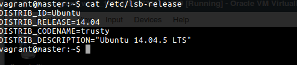
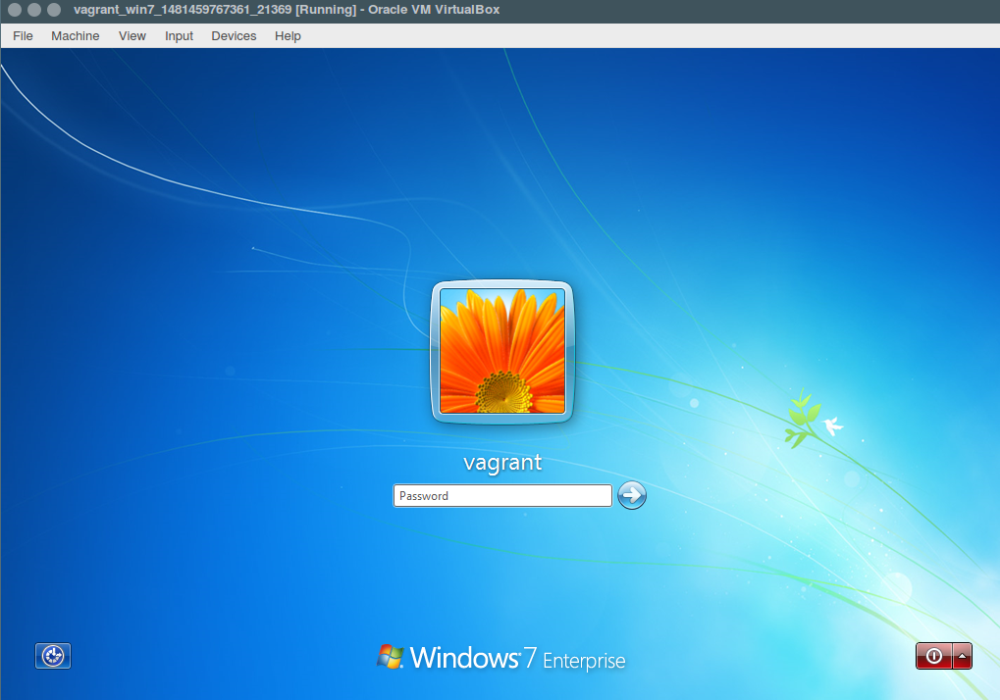

#Linuxin keskitetty hallinta

#TÄMÄ MODUULI ON VANHA JA EI TOIMINUT! UUSI MODUULI LÖYTYY [TÄÄLTÄ](https://github.com/juhmtti/linuxhallinta/blob/master/oma_moduuli/puppet_gpo.md)

####Juha-Matti Ohvo

##1. Moduuli

Luodaan Puppet-moduuli Windowsille, joka luo kaksi ryhmää. Molemmille ryhmille määritellään erilaiset salasanavaatimukset ja asennetaan molemmille ryhmille eri nettiselaimet käyttäen Chocolateyta.

##2. Työn asetelma

Tehtävää varten otamme käyttöön kaksi tietokonetta. Toinen on Windows 7 Professional 64-bittinen työpöytä, jota varten teemme moduulin, jolloin se toimii Puppet agenttina. Windowsille ei voida asentaa Puppetmasteria, joten siksi meidän on luotava ome Linux-palvelin, jolle asennamme sen. Linux-palvelinkäyttöjärjestelmänä toimii Ubuntu 14.04.5 LTS 64-bit. Syy miksi käytämme tehtävässä 14.04 -versiota, johtuu Vagrantista, sillä uusin 16.04.1 Xenial boxin sudo-salasanan kanssa on ongelmia. Työn kannalta ei kuitenkaan ole merkitystä, kumpaa versiota Ubuntusta käytämme.

Asennamme Windows 7 -käyttöjärjestelmän virtuaalikoneelle, joka on luotu Vagrantilla ja käyttää Virtualboxia. Lataamme valmiin levykuvan. Muotoillaan virtuaalikone seuraavasti Vagrantfileen.

  	config.vm.define "win7" do |win7|
  		win7.vm.box = "designerror/windows-7"
  		win7.vm.network "private_network", ip: "192.168.0.100"
  	end

Puppetmaster ollaan määrtelty seuraavanlaisesti Vagrantfileen.

  	config.vm.define "master" do |master|
  		master.vm.box = "ubuntu/trusty64"
  		master.vm.network "private_network", ip: "192.168.0.11"
  	end

Täytyy myös ottaa huomioon, ettei Vagrant tue oletuksena graafista käyttöliittymää, joka on välttämätöntä Windowsia varten. Graafinen käyttöliityma (GUI) voidaan ottaa käyttöön muokkaamalla Vagrantfilea. Lisäksi koneille on allokoitu 512 megatavua keskusmuistia.

  	config.vm.provider "virtualbox" do |vb|
  		vb.gui = true
  		vb.memory = "512"
  	end

##3. Koneiden käyttöönotto

Kun virtuaalikoneet ollaan määritelty Vagrantfileen, käynnistetään molemmat tietokoneet.

    $ vagrant up master win7

Molemmat koneet käynnistyvät onnistuneeti.

Otetaan SSH-yhteys master-koneelle

    $ vagrant ssh master

Pingaaminen ei toimi heti alkuun, sillä Windowsin palomuuri on asetettu estämään ICMP-sanomat. Sallitaan pingaaminen, jotta voimme varmistaa koneiden välisen kommunikoinnin toimivuuden.

  palomuurikuva

Testaan master-koneella, että pingaaminen Windows-koneeseen toimii.

  ping kuva masterilta windowsille

##4. Windows-koneen valmisteleminen Puppet-agentiksi

Ensiksi meidän on varmistettava, jotta sekä master- että Windows-koneet löytävät toisensa hostnamella. Tämä on välttämätöntä Puppetmasterin konfiguroinnin kannalta.

Koska haluamme asentaa Puppetilla ohjelmia agentille, tarvitseme erillisen paketinhallintaohjelman tätä varten, koska Windowsissa ei ole omaa paketinhallintaohjelmaa. Käytämme Chocolateyta, joka toimii samalla toimintaperiaatteella kuin Linuxin paketinhallintaohjelmat (apt Debian, yum RHEL, yast SUSE jne.). Chocolatey toimii joko Powershellilla tai perinteisellä komentorivillä. Chocolateylla on oma pakettivarasto, jossa on ylläpidettynä jopa 15 000??? eri ohjelmistoa.

Asennetaan Chocolatey Windows-koneelle Powershellillä.

    C:\Users\Vagrant> @powershell -NoProfile -ExecutionPolicy Bypass -Command "iex ((New-Object System.Net.WebClient).DownloadString('https://chocolatey.org/install.ps1'))" && SET "PATH=%PATH%;%ALLUSERSPROFILE%\chocolatey\bin"

Puppettia varten ladataan WinSCP and putty -ohjelmat ssh- ja sftp-protokollia varten. Kun nämä ovat ladattu, asennetaan Puppet client Windows-koneelle.

###4.1 Puppet-masterin asentaminen master-koneelle

Tehtävää varten noudatetaan Puppetin virallisia ohjeita, kuinka asennus tehdään, jotta varmistetaan asennuksen sujuvuus.

##Lähteet

* https://forge.puppet.com/cannonps/local_group_policy
* https://docs.puppet.com/pe/latest/windows_installing.html
