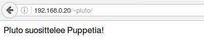

##Linuxin keskitetty hallinta

####Juha-Matti Ohvo

###Alkuasetelma

Vagrantilla on luotu virtuaalikone, Ubuntu 14.04.5 LTS. Luomme moduulin, joka asentaa Apachen ja konfiguroi valmiiksi virtuaalihostit, käyttäjien kotihakemistot ja hosts-tiedoston nimet.

Asennetaan ensiksi koneelle Puppet

	sudo apt-get update
	sudo apt-get install puppet -y

Tarkistetaan, että asennus onnistui ja mikä versio asennettiin.

	puppet --version

Puppet versiomme on 3.8.5

###Moduulin luominen

Luodaan /etc/puppet/modules/ hakemistoon uusi hakemisto, johon moduulimme luodaan. Luomme apache-nimisen moduulin. Luomamme hakemiston alle luodaan vielä hakemistot "manifests" ja "templates".

	cd /etc/puppet/modules/
	sudo mkdir -p apache/manifests apache/templates

Luodaan manifests-hakemistoon init.pp tiedosto, johon moduuli kirjoitetaan.

###Moduulin testaaminen

Ajettaessa moodulia ensimmäisen kerran tuli virheilmoitus:

	"Warning: Could not retrieve fact fqdn"

Tämä johtuu siitä, että vagratilla tekemällä koneellamme on kyllä nimi, muttei FQDN-nimeä. Tarkastetaan /etc/hosts -tiedoston sisältöä

	127.0.0.1	puppetslave	puppetslave

Toimialueen nimi olkoot "local" ja lisätään se hosts-tiedostoon.

	127.0.0.1	puppetslave.local	puppetslave

Tallennetaan tiedosto ja ajetaan facter-komento, jonka pitäisi tulostaa koneemme FQDN-nimi.

	facter fqdn
	
Tulostuksena saamme nyt puppet.local, joka on koneen FQDN.

Kokeillaan moduulin ajamista uudelleen.

	sudo puppet apply --modulepath /etc/puppetmodules/ -e "class {"apache":}"

###Käyttäjäkohtaisten kotisivujen testaaminen

Moduulia ajettaessa emme saa virheilmoituksia, joten testataan, että uusi käyttäjä voi tehdä kotisivuja. Luodaan uusi käyttäjä pluto.

	sudo adduser pluto

Luontivaiheen jälkeen mennään pluton kotihakemistoon ja tarkistetaan, että "public_html"-hakemisto löytyy sieltä.

	ls |grep public_html

Hakemisto löytyy käyttäjän kotihakemistosta. Luodaan hakemistoon index-html -tiedosto ja lisätään sinne teksti "Pluto suosittelee Puppettia".

Vagrantilla luodumme koneen ip:osoite on 192.168.0.20, joten tarkistetaan verkkoselaimella, että luotu tiedosto näkyy.

Kuten kuvasta näkee, niin onnistuimme tekemään moduulin onnistuneesti, joka asentaa meille Apache2-palvelimen, poistaa oletuksena olevan index-html -tiedoston /var/www/html -hakemistosta, ottaa käyttäjien kotihakemistot käyttöön ja luo public_html -hakemiston skel-hakemistoon.

###Yhteenveto

Tehtävä oli itselleni hyvää Puppet-kertaamista ja pahempia ongelmatilanteita ei itselleni koitunut. Tehtävän tekemiseen käytin aikaa arviolta kaksi tuntia.

###Lähteet

http://terokarvinen.com
https://www.puppetcookbook.com/
