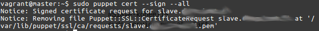
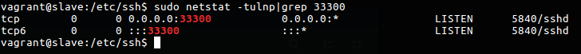
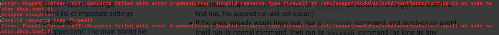

#Linuxin keskitetty hallinta

####Juha-Matti Ohvo

##Tehtävänanto

Tehtävässä luomme yhteyden Puppet master- ja orjakoneen välillä ja ajamme moduuleja koneiden 
välillä. Teemme kaksi virtuaalikonetta Vagrantilla ja molemmissa koneissa pyörii Ubuntu 14.04.1 
Xenial 64-bittiset käyttöjärjestelmät. Koneille on varattu 512 mb keskusmuistia.

##Virtuaalikoneiden luonti

Teemme harjoituksen käyttäen Vagrant-virtuaalikoneita. Koneet on provisioitu siten, että 
Puppet asennetaan molemmille koneille automaattisesti käynnistyksen yhteydessä.
	
Vagrantfile näyttää tältä:

	config.vm.box = "base"

		config.vm.define "master" do |master|
			master.vm.box = "ubuntu/trusty64"
			master.vm.network "private_network", ip: "192.168.0.11"
			master.vm.provision "shell", path: "master.sh"
		end

		config.vm.define "slave" do |slave|
			slave.vm.box = "ubuntu/trusty44"
			slave.vm.network "private_network", ip: "192.168.0.22"
			slave.vm.provision "shell", path: "slave.sh"
		end	

Master-koneen provisiointi:

	#!/bin/bash

	sudo apt-get update
	sudo apt-get install puppetmaster -y

Slave-koneen provisiointi:

	#!/bin/bash

	sudo apt-get update
	sudo apt-get install puppet -y

Harjoituksessa käytetään valmiita Vagrant-koneiden boxeja ja muussa käytössä olen kohdannut ongelmia Ubuntu 16.04.1 64-bittisten koneiden kanssa, joten käytämme versiota 14.0.4.5 64-bit jonka olen todennut täysin toimivaksi muissa projekteissani.

Käynnistetään virtuaalikoneet.

	vagrant up

Kun koneet ovat käynnistetty, otetaan niihin SSH-yhteydet.

	vagrant ssh [koneen nimi, tässä tapauksessa master/slave]

##Koneiden nimien muuttaminen

Asennamme molempiin koneisiin avahi-daemonin

	sudo apt-get install -y avahi-daemon

Asetetaan koneille uusi hostname hostnamectl-komennolla.

	sudo hostnamectl set-hostname [hostnimi, eli master/slave]

Kun nimet ovat muutettu molemmilla koneilla, käynnistetään avahi-daemon uudelleen.

	sudo service avahi-daemon restart

Pingataan koneilla itseään ja myös toista konetta, jolla tiedämme, toimiiko asettamamme .local-nimet

	ping master.local
	ping slave.local

Pingaaminen toimi molemmin päin, joten .local-nimien asettaminen tehtiin onnistuneesti.

##Puppetmasterin konfigurointi

Master-koneella olemme valmiiksi asentaneet Puppetmasterin provisioinnin yhteydessä, joten ensiksi 
sammutetaan kyseinen palvelu.

	sudo service puppetmaster stop

Poistetaan ssl-sertifikaatit

	sudo rm -r /var/lib/puppet/ssl

Lisätään dns-nimet Puppetin asetustiedostoon.

	echo "dns_alt_names = master.local" | sudo tee -a /etc/puppet/puppet.conf

Käynnistetään Puppetmaster-palvelu.

	sudo service puppetmaster restart

##Slave-koneen konfigurointi

Myös slave-koneella on Puppet valmiina asennettuna, joten aloitetaan lisäämällä master-koneen nimi 
/etc/puppet -tiedostoon.

	echo -e "[agent]\nserver = master.local" | sudo tee -a /etc/puppet/puppet.conf

Ajetaan Puppet käynnistymään aina käynnistyksen yhteydessä.

	echo "START=yes" | sudo tee -a /etc/default/puppet

Käynnistetään Puppet-palvelu uudelleen.

	sudo service puppet restart

##Sertifikaatin allekirjoitus

Master-koneella tehdään sertifikaatin allekijoitus, jolloin slave-kone saadaan master-koneen 
ohjattavksi.

	sudo puppet cert --list

Master-kone ei tulosta lainkaan koneita, joten yritetään vielä ssl-sertifikaattien poistoa 
molemmilla koneilla.

Ensiksi slave-koneella:

	sudo service puppet stop
	sudo rm -r /var/lib/puppet/ssl

Sitten master-koneella samat komennot. Käynnistetään seuraavaksi palvelut.

	#Master koneella
	sudo service puppetmaster start

	#Slave-koneella
	sudo service puppet start

Nyt kun ajetaan aiempi "sudo puppet cert --list" -komento, niin ilmestyy uusi kone, joka on 
slave-kone, koska muita koneita ei ympäristössä ole. Allekirjoitetaan sertifikaatti.

	sudo puppet cert --sign --all

Sertifikaatin allekirjoittamisessa ei ilmene virheilmoituksia, joten olemme onistuneesti liittäneet 
slave-koneen Puppetmasterin haltuun.

##Moduulin luominen

Luomme moduulin, joka asentaa SSH-palvelun ja asettaa uuden porttinumeron palvelulle. Luodaan 
ensiksi tarvittavat hakemistot /etc/puppet -hakemistoon.

	cd /etc/puppet
	sudo mkdir -p manifests/ modules/sshd/manifests

Luodaan manifests-hakemistoon site.pp -manifesti.

	sudoedit manifests/site.pp

Lisätään manifestiin seuraava tekstirivi.

	include sshd

Seuraavaksi luodaan varsinainen moduuli, joka tulee modules/sshd/manifests -hakemistoon. Manifestin 
nimeksi tulee init.pp ja koska moduulimme käyttää templatea, niin luodaan niille erillinen 
hakemisto.

	sudo mkdir -p modules/sshd/templates
	sudoedit modules/sshd/manifests/init.pp

Manifesti init.pp näyttää tältä.

	class sshd {

		# An array of required packages
		$packages = ["openssh-server", "ufw"]

		# Install packages
		package { $packages:
			ensure => "installed",
		}
	
		# SSH service, start on boot and ensure it's running
		service { "ssh":
			ensure => "running",
			enable => true,
		}

		# Template file
		file { "/etc/ssh/sshd_config":
			content => template("sshd/sshd_config"),
			require => Package["openssh-server"],
			notify  => Service["ssh"],
		}
	
		# Ufw setup
		exec { "ufw_allow":
			path    => "usr/sbin",
			command => "/usr/sbin/ufw enable && /usr/sbin/ufw allow 33300/tcp && /usr/sbin/ufw reload",
			require => Package["ufw"],
			notify	=> Service["ssh"],
		}
	}

Kopioidaan sshd-config -tiedosto templates-hakemistoon.

	sudo cp /etc/ssh/sshd_config modules/sshd/templates/

Muokataan tiedostoa ja muutetaan parametri "Port 22" vaikkapa "Port 33300", jolloin uusi porttinumeromme on 33300.

	sudoedit modules/sshd/templates/sshd_config

	Port 33300

Ajetaan nyt moduulimme.

	sudo puppet apply --modulepath /etc/puppet/modules/ -e "class {"sshd":}"

	Notice: Compiled catalog for master.dhcp.inet.fi in environment production in 0.16 seconds
	Notice: /Stage[main]/Sshd/Exec[ufw_allow]/returns: executed successfully
	Notice: /Stage[main]/Sshd/Service[ssh]: Triggered 'refresh' from 1 events
	Notice: Finished catalog run in 0.42 seconds

Virheitä ei ilmene, joten moduuli ajettiin onnistuneesti. Mennään slave-koneelle ja tarkistetaan, että halutut muutokset ovat tulleet voimaan. Asetimme SSH-palvelun uudeksi porttinumeroksi 33300:n, joten katsotaan pyöriikö palvelu kyseisessä portissa.

	sudo puppet agent --test

	Info: Retrieving plugin
	Info: Caching catalog for slave.dhcp.inet.fi
	Info: Applying configuration version '1478606716'
	Notice: /Stage[main]/Sshd/Exec[ufw_allow]/returns: executed successfully
	Info: /Stage[main]/Sshd/Exec[ufw_allow]: Scheduling refresh of Service[ssh]
	Notice: /Stage[main]/Sshd/Service[ssh]: Triggered 'refresh' from 1 events
	Notice: Finished catalog run in 0.77 seconds

Tarkistetaan pyöriikö sshd-palvelu portissa 33300.

	sudo netstat -tunlp|grep 33300

Kuten kuvasta näkyykin, moduulin täytyi asentaa openssh-server, muuttaa palvelun porttinumero 33300:ksi templatella ja lisätä uusi sääntö ufw-palomuuriin. Täten tehtävä on onnistunut.

##Ongelmatilaneet

Asensin Puppet-moduulin palomuurin asetuksia varten, mutta kun käytin resurssia "firewall", sain seuraavanlaisen virheilmoituksen.

Käytin sen sijaan exec-resurssia, joka toimi onnistuneesti, mutta tuskin on hyvän tavan mukaista.

##Yhteenveto

Tehtävässä en kohdannut muita ongelmia paitsi palomuuriresurssien käytössä, joiden 
toimimattomuudelle en googlettamallakaan löytänyt järkeviä syitä. Tehtävän tekemiseen kului aikaa 
arviolta kaksi tuntia.

##Lähteet

* http://terokarvinen.com
* https://puppetcookbook.com
