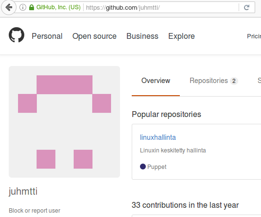

#Linuxin keskuitetty hallinta

####Juha-Matti Ohvo

##Tehtävänanto

"Tee tavallisia työpöydän asetuksia puppet moduleiksi. Laita ne versionhallintaan. Konfiguroi tyhjä 
kone, vaikkapa juuri bootattu live-USB, lataamalla puppet-asetukset versionhallinnasta."

Teemme moduulin, joka muuttaa asentaa Firefox-selaimen ja muokkaa käyttäjän 
profiilia, eli muuttaa kotisivun.

##1. Alkuasetelma

Tehtävässä on käytössä kaksi Vagrantilla luotua virtuaalikonetta, joissa molemmissa pyörii Ubuntu 
14.04.5 64-bittinen käyttöjärjestelmä ja joille on varattu 512 megatavua keskusmuistia. Koneet ovat nimetty masteriksi ja slaveksi.

Tehtävässä on jo valmiiksi luotu Puppetmasterin ja agentin välille sertifikaatti ja komentojen 
suorittaminen verkon yli toimii [tehtävän 2 
mukaisesti.](https://github.com/juhmtti/linuxhallinta/blob/master/tehtava2/tehtava2.md)

Olemme ottaneet Vagrantissa käyttöön graafisen ulkoasun, jotta voimme käyttää työpöytää 
slave-koneella. Muutos tehdään Vagrantfileen.

	config.vm.provider "virtualbox" do |vb|
		# Display the VirtualBox GUI when booting the machine
		vb.gui = true
	end

##2. Moduulien luonti

Luomme firefox-nimisen moduulin. Tämä tehdään master-koneella.

	cd /etc/puppet
	sudo mkdir -p modules/firefox/manifests modules/firefox/templates

Moduulin init.pp näyttää seuraavanlaiselta:

	class firefox {

		# Installs Firefox web browser
		package { "firefox":
			ensure => "installed",
		}
		
		#
		file { "/etc/firefox/syspref.js":
			content => template("/firefox/syspref.js"),
		}
	}

Template-tiedoston eli "syspref.js" sisältää Firedox-käyttäjäprofiiliasetuksia.

	pref('browser.startup.homepage', "http://github.com/juhmtti");

##3. Moduulin ajaminen

Puppet slavella ajetaan komento.

	$ sudo puppet apply --test

Moduuli ajetaan onnistuneesti, joten avataan Firefox-selain ja katsotaanmikä sivusto on kotisivuna.

Selaimen avauduttua kotisivuna toimii asettamamme Github-sivu!

##4. Moduulin vieminen versionhallintaan (Github)

Jotta voimme tallentaa moduulimme Githubiin, meillä täytyy olla käytössä Git-versionhallinta. Asennetaan Git.

	$ sudo apt-get update && sudo apt-get install git -y

Asetetaan Github-käyttjämme sähköposti ensiksi.

	$ git config user.email "[sähköpostiosoite]"

Tämän jälkeen lisätään moduulimme working spaceen.

	$ git add .

Tehdään commit.

	$ git commit -m "initial version"

Viedään tiedosto lopullisesti versionhallintaan.

	$ git push

	# Tässä vaiheessa annetaan Github-kirjautumistiedot

Nyt moduuli on viety versionhallintaan ja se voidaan hakea sieltä halutessa, kun esimerkiksi uusi työasema otetaankäyttöön.

	$ git clone [repositoryn url-osoite]

##Pohdinnat

Tehtävä oli mielenkiintoinen Firefoxin osalta, koska käyttäjäprofiilien tallentaminen profiilitiedostoon helpottaa selaminen käyttöönottoa. Git ei tarjonnut sen suurempia haasteita, koska käytän sitä itse aktiivisesti.

##Lähteet

* http://terokarvinen.com
* https://puppetcookbook.com
