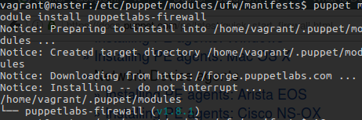
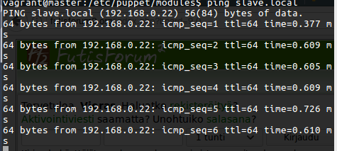
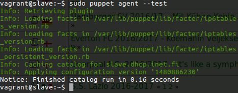
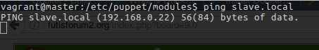

#Tehtävä 4

####Juha-Matti Ohvo

##Tehtävänanto

Sovita jonkun kurssin ulkopuolisen tekemä puppet-moduli itsellesi ja testaa sitä.

Laita raporttisi liitteeksi tai linkiksi:

sudo tail --lines=100 /home/*/.bash_history /var/log/auth.log /var/log/apache2/*.log /var/log/syslog /var/log/installer/syslog /proc/uptime /etc/lsb-release >log-picks-$(date +'%Y-%m-%d_%H%M').txt

##1. Alkuasetelma

Tehtävää varten olemme luoneet kaksi virtuaalikonetta, "master" ja "slave". Olemme asentaneet koneille avahi-daemonin ja ottaneet käyttöön .local-nimet. Molemmissa virtuaalikoneissa on asennettuna Ubuntu 16.04.1 64-bit ja niille on varattu 512 mb keskusmuistia.

Tehtävässä olen valinnut Puppetin firewall-moduulin, josta aion käyttää siten, että agentin palomuuriin voidaan luoda säännöstä Puppetilla. Esimerkki löytyy [Pupetin omasta dokumentaatiosta](https://docs.puppet.com/pe/latest/quick_start_firewall.html).

##2. Moduulin asentaminen

Asennetaan firewall-resurssi. Halusin ehdottomasti kokeilla tätä resurssia tässä tehtävässä, koska aiemmin olen toteuttanut iptables-säännökset execillä, joka ei kuitenkaan vastaa hyviä käytäntöjä, koska jos portin tila muuttuu, exec ei muuta sitä takaisin vaan moduuli täytyisi ajaa uudelleen.

Master-koneella asennetaan firewall-moduuli Puppetlabsista.

	$ puppet module install puppetlabs-firewall

Mitään virheilmoituksia ei ilmene.

##Firewall-resurssin testaaminen

Määritellään ufw-moduulin init.pp-tiedostoon firewall-resurssi, joka estää icmp-sanomat. Testataan ensiksi, että ICMP-sanomat menevät läpi.

	$ vagrant@master:/$ ping slave.local

Kuvasta näkyy, että ping toimii.

Jostain syystä firewall-resurssi ei tahtonut millään toimia ja noin kahden tunnin pähkäilyn jälkeen ymmärsin, että moduuli oli asentunut käyttäjän kotihakemistoon ja edelleen .puppet-alihakemistoon, joten kopioimalla moduulin /etc/puppet/modules -hakemistoon pitäisi toimia.

	$ sudo cp /home/vagrant/.puppet/firewall /etc/puppet/modules

Sain virheilmoituksen, että firewall hakemisto on olemassa /etc/puppet/modules -hakemistossa, joten jostain kumman syystä se ilmestyi sinne kuin tyhjästä. Syytä en osaa sanoa tälle, mutta uskon että moduulin asentumisen jälkeen kestää hetki ennen kuin resurssit ovat käytettävissä.

Nyt luodaan uusi moduuli "ufw" ja luodaan sille init.pp manifests-hakemistoon.

	$ sudo mkdir -p /etc/puppet/modules/ufw/manifests
	$ sudoedit modules/ufw/manifests/init.pp

Määritellään tiedostoon uusi firewall-resurssi.

	class ufw {

		firewall { '000 deny icmp':
			proto  => "icmp",
			action => "drop",
		}
	}

Agentilla ajetaan seuraava komento:

	$ sudo puppet apply --test

Katsotaan, meneekö ping nyt agentille.

	vagrant@master:/$ ping slave.local

Kuten kuvasta näkee, niin mitään ilmoituksia ei tule, joten voi hyvin olettaa, että moduuli toimii ja ICMP-protokolla ollaan estetty agent-koneella

##Johtopäätökset

Tehtävään valittu moduuli ei tahtonut alkuun toimia, mutta parin tunnin etsimisen jälkeen onneksi pääsin eteenpäin. Tehtävän aikana opin enemmän valmiiden Puppet-moduulien käyttämisestä ja erityisesti palomuurin säännöksiä varten uskon Puppetin olevan loistava ratkaisu, koska valmiilla moduulilla voidaan konfiguroida iptables vaivattomasti (esimerkiksi Fedorassa ei ole ufw:tä, joka helpottaa palomuurin hallintaa). Tehtävään minulla kului aikaa arviolta neljä tuntia.

##Lähteet

https://puppetcookbook.com
http://terokarvinen.com
https://forge.puppet.com/puppetlabs/firewall
